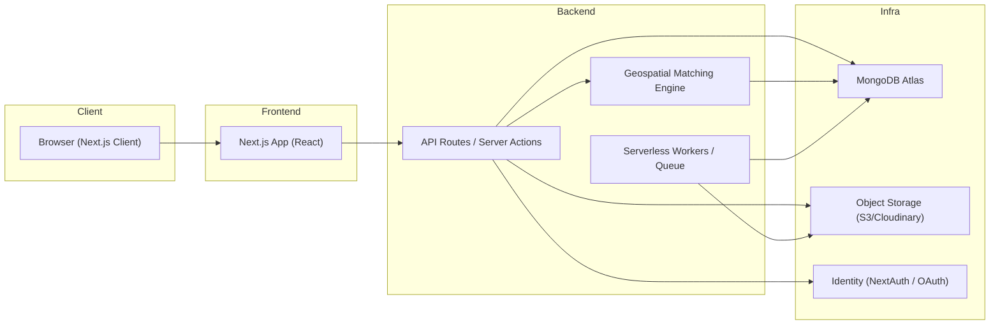

# matching-geoespacial-saas
matching-geoespacial-saas
# Arquitectura del Sistema

**Sprint 3 — Día 1: Diseño de arquitectura y estructura del proyecto**

---

## Resumen ejecutivo

Este documento define la arquitectura técnica del SaaS *matching-geoespacial-saas* para la primera versión (MVP) que se desarrollará durante el Sprint 3. Contiene la visión general de componentes, el modelo cliente‑servidor basado en Next.js, el motor de matching geoespacial, la estructura de carpetas oficial y las decisiones tecnológicas clave.

---

## Decisión arquitectónica (alto nivel)

**Patrón:** SaaS monorepo con Next.js como framework Fullstack (React + Server-Side capabilities).

**Capas:**

* **Frontend**: Next.js (App Router / React) — UI, rutas públicas/privadas, SSR/SSG y Server Components cuando aplique.
* **Backend**: API Routes / Server Actions (según flujo) y microservices opcionales en funciones serverless (Vercel / Cloud Functions / AWS Lambda) para cómputos pesados.
* **DB**: MongoDB Atlas (colecciones con índices geoespaciales `2dsphere`).
* **Matching Engine**: módulo Node.js que usa operadores geoespaciales de MongoDB (aggregation + $geoNear / $nearSphere) y lógica adicional (filtros por atributos, scoring, caching).
* **Autenticación**: NextAuth.js (adaptable a JWT si se prefiere)
* **Almacenamiento de archivos**: S3 / Spaces / Cloudinary (para imágenes de propiedades).
* **Observabilidad**: Logs en la nube + APM (Sentry / Logflare) y métricas básicas.

---

## Diagrama de arquitectura (Mermaid)



---

## Modelo cliente‑servidor con Next.js

**Estrategia:** Usar Next.js App Router con Server Components donde aporte (p. ej. para páginas de dashboards protegidos). Implementar endpoints **/api/** para operaciones RESTful y, para acciones que requieran SSR o seguridad en el servidor, usar Server Actions o API Routes según convenga.

**Responsabilidades:**

* **Cliente (Browser / React)**: UI, validaciones leves, consumo de APIs públicas, interacción en tiempo real mínima (WebSockets opcional para notificaciones).
* **Servidor (Next.js Server / Serverless)**: autenticación, autorización, lógica de negocio, consultas geoespaciales, integraciones con servicios externos.
* **DB**: persistencia, consultas geoespaciales indexadas, agregaciones para ranking.

---

## Geospatial Matching Engine — diseño y flujo

**Objetivo:** Dado un criterio de búsqueda (p. ej. lat, lng, radio, filtros), devolver propiedades ordenadas por relevancia y distancia.

**Técnicas principales:**

* Índices: crear índice `2dsphere` sobre `location` (`{ type: "Point", coordinates: [lng, lat] }`).
* Consultas: usar `$geoNear` (aggregation) o `$nearSphere` con `distanceField` para cálculo de distancia.
* Scoring: combinar distancia con otros factores (precio, rating, coincidencia de atributos) mediante `meta-score` en una pipeline de aggregation.
* Caching: resultados frecuentes guardados en Redis (opcional) para acelerar búsquedas repetidas.

**Ejemplo de pipeline (MongoDB aggregation):**

```js
// Ejemplo con $geoNear
db.properties.aggregate([
  {
    $geoNear: {
      near: { type: "Point", coordinates: [lng, lat] },
      distanceField: "dist.calculated",
      spherical: true,
      maxDistance: radiusInMeters, // opcional
      query: { published: true }
    }
  },
  // aplicar filtros adicionales
  { $match: { price: { $gte: minPrice, $lte: maxPrice } } },
  // calcular score combinando distancia y otros factores
  { $addFields: { score: { $multiply: [ { $subtract: [1, { $divide: ["$dist.calculated", radiusInMeters ] }] }, 0.7 ] } } },
  { $sort: { score: -1, "dist.calculated": 1 } },
  { $limit: 100 }
])
```

**Consideraciones:**

* Validar y normalizar coordenadas (lng, lat).
* Manejar casos con propiedades sin `location`.
* Evitar consultas sin índices que provoquen collection scans.

---

## Estructura oficial de carpetas (propuesta)

```
matching-geoespacial-saas/
├─ .github/
├─ .vscode/
├─ .env.example
├─ README.md
├─ package.json
├─ next.config.js
├─ /app
│  ├─ layout.tsx
│  ├─ page.tsx
│  ├─ /dashboard
│  │  ├─ admin/page.tsx
│  │  ├─ agente/page.tsx
│  │  └─ cliente/page.tsx
│  └─ /properties
│     ├─ page.tsx
│     ├─ [id]/page.tsx
├─ /components
│  ├─ ui/ (shadcn components)
│  ├─ forms/
│  ├─ maps/ (leaflet / react-map-gl wrappers)
├─ /lib
│  ├─ mongodb.ts
│  ├─ auth.ts
│  └─ geo.ts (helpers: haversine, normalizers)
├─ /models
│  ├─ User.ts
│  ├─ Property.ts
├─ /api
│  ├─ auth/
│  │  ├─ register.ts
│  │  ├─ login.ts
│  ├─ properties/
│  │  ├─ index.ts (GET, POST)
│  │  ├─ [id].ts (GET, PUT, DELETE)
├─ /utils
│  ├─ validators.ts
│  ├─ permissions.ts (middleware)
├─ /scripts
│  ├─ seed.js
│  └─ migrate.js
└─ /docs
   └─ architecture/ (diagrams export)
```

**Notas:**

* Usar `/app` (App Router) para Next.js moderno.
* Mantener `lib/mongodb.ts` como conexión singleton para evitar múltiples conexiones en dev.
* Colocar endpoints "API" en `/api` (Next.js API routes) para lógica REST y `server actions` dentro de componentes cuando sea apropiado.

---

## Modelos de datos (resumen)

### User

```js
{
  _id: ObjectId,
  name: String,
  email: String,
  passwordHash: String,
  role: String, // [admin, agente, cliente, propietario]
  createdAt: Date,
}
```

### Property

```js
{
  _id: ObjectId,
  title: String,
  description: String,
  price: Number,
  location: { type: "Point", coordinates: [lng, lat] },
  address: String,
  images: [String],
  ownerId: ObjectId,
  published: Boolean,
  createdAt: Date,
}
```

---

## Endpoints claves (iniciales)

* `POST /api/auth/register`
* `POST /api/auth/login`
* `POST /api/auth/logout`
* `GET /api/properties?lng={}&lat={}&radius={}`
* `POST /api/properties` (protected)
* `GET /api/properties/:id`
* `PUT /api/properties/:id` (protected / owner)
* `DELETE /api/properties/:id` (protected / owner)

---

## Variables de entorno recomendadas (.env.example)

```
NEXTAUTH_SECRET=
NEXTAUTH_URL=
MONGODB_URI=
MONGODB_DB=
JWT_SECRET=
CLOUDINARY_URL=
STORAGE_PROVIDER=cloudinary
REDIS_URL=
```

---

## Decisiones técnicas y justificaciones rápidas

* **Next.js como Fullstack**: acelera prototipado y permite Server Components para seguridad/SEO.
* **MongoDB Atlas**: soporte nativo para consultas geoespaciales y escalabilidad sencilla.
* **NextAuth.js** inicialmente para acelerar el login; cambiar a JWT si se requiere microservices.
* **Shadcn/UI + Tailwind**: rapidez para crear UI consistente y componentes reutilizables.

---

## Riesgos y mitigaciones

* **Riesgo:** Consultas geoespaciales mal indexadas que degradan rendimiento.
  **Mitigación:** Índices 2dsphere y pruebas de rendimiento en dataset de prueba.

* **Riesgo:** Exposición de credenciales en repositorio.
  **Mitigación:** `.env.example` y uso de secrets en GitHub Actions / Vercel.

* **Riesgo:** Complejidad de roles/permissions.
  **Mitigación:** Middleware centralizado `permissions.ts` y pruebas E2E básicas.

---

## Checklist del Día 1 (acciones concretas)

1. Crear el archivo `Arquitectura_del_Sistema.md` (este documento).
2. Crear diagrama en Mermaid (ya incluido) y exportar PNG/SVG a `/docs/architecture/`.
3. Crear repo `matching-geoespacial-saas` en GitHub y subir `README.md` con esta arquitectura.
4. Inicializar proyecto Next.js localmente (comando sugerido más abajo).
5. Crear `lib/mongodb.ts` con conexión reutilizable.
6. Crear esquemas Mongoose básicos (`/models/User.ts`, `/models/Property.ts`).
7. Añadir `.env.example` al repo.

**Comando para inicializar Next.js**

```bash
npx create-next-app@latest matching-geoespacial-saas --typescript --eslint
```

---

## Siguientes pasos inmediatos (para Sprint 3)

* Martes 21: diseño de UI/UX — crear wireframes y añadirlos a `/DOCUMENTACION/DISEÑO/WIREFRAMES_PROYECTO.pdf`.
* Miércoles 22: setup del entorno — ejecutar comandos e instalar dependencias listadas.

---

*Documento generado para el Sprint 3 — Día 1.*
